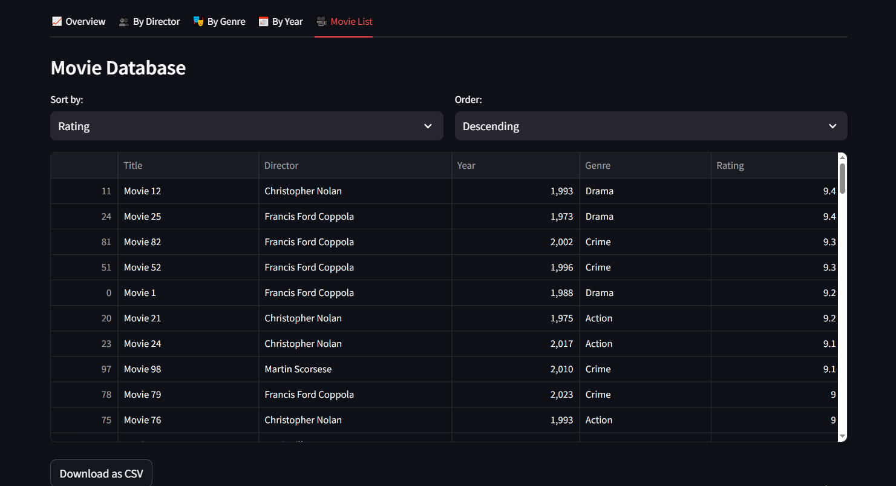
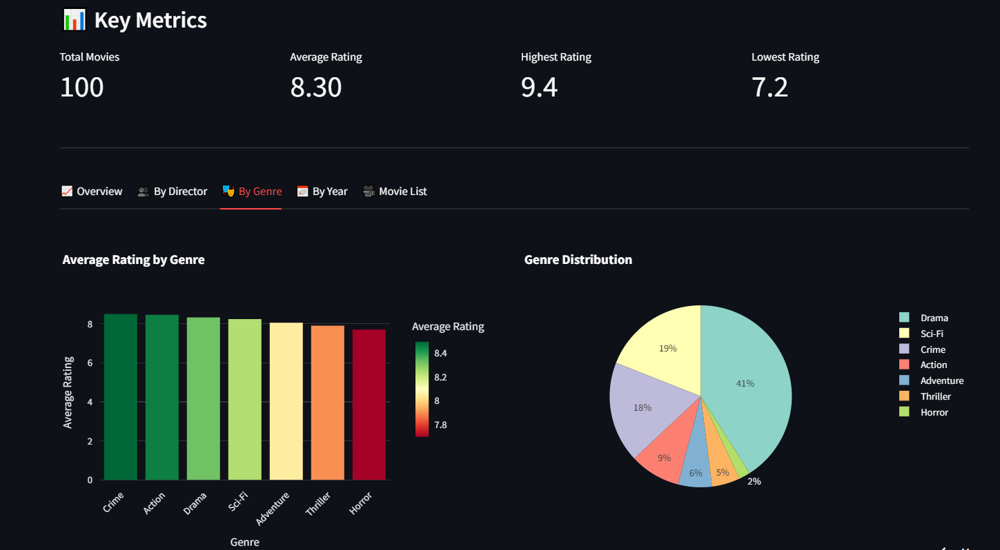

### 1. Clone the repository

```bash
https://github.com/LawrenceOtieno/MovieRatingsDashboard.git
cd MovieRatingsDashboard
```

### 2. Install dependencies

```bash
pip install -r requirements.txt
```

### 3. Run the app

```bash
streamlit run app.py
```

---

## ☁️ Deployment

The dashboard is deployed on **Streamlit Cloud**. Ensure the following are included in your `requirements.txt`:

```
streamlit
pandas
plotly
```

---

## 📈 Key Insights Highlighted

* Crime and Sci-Fi genres show higher average ratings compared to other genres
* Certain directors consistently outperform others in average movie ratings
* Ratings remain relatively stable across decades with slight upward trends in recent years
* Synthetic data modeling can effectively simulate real-world analytical scenarios

---

## 🌐 Live Demo

👉 **Live Dashboard:** [https://your-streamlit-app-url.streamlit.app](https://movieratingsdashboard-na2stfppvawqeukfmzx2ah.streamlit.app/)

---

## 🖼️ Screenshots

### Movie List (Synthetic)



### Overview


### Ratings by Director


### Ratings by Genre



### Ratings by Year


---

## 📬 Feedback

Suggestions and improvements are welcome. Feel free to raise issues or submit pull requests to enhance functionality or visual depth.

---

### ✅ Status

The project is actively maintained and open for further contributions in areas such as:

* Expansion of the synthetic dataset (more movies, genres, and directors)
* Time-series analysis of movie ratings by release year or decade
* Integration of real-world movie datasets (e.g. IMDb, TMDb) via APIs
* Predictive modeling of movie ratings based on genre and director
